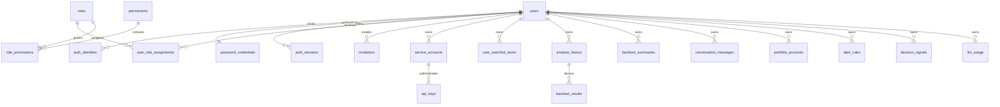

# 多用户身份、登录与权限体系 PRD

> 实际上线操作请配合[多用户登录与权限启用指南](multi-user-auth-deployment-guide.md)执行，其中包含备份、迁移、Docker、反向代理、逐模块验收和回滚步骤。

> 文档状态：已确认进入 P0 实施  
> 适用范围：Web、Desktop、API、Bot、自动化任务、数据库  
> 最后更新：2026-08-25

## 1. 背景

DSA 当前提供多市场行情与新闻聚合、AI 决策报告、策略问股、持仓管理、回测、实时告警、系统配置和多渠道通知。现有 Web 登录采用可选的单一管理员口令：所有登录者共享同一密码和权限，Session 不包含用户主体，业务数据也没有完整的用户归属关系。

该模型适合单人自托管，但不能安全支持家庭、投研小组或公共 SaaS。多用户改造不能只增加 `admin/user` 枚举，必须同时建立身份、角色、权益和资源归属四个互相独立的维度。

## 2. 产品目标

1. 普通工作台、管理员后台、Desktop、Bot 和 API 使用互不冲突的认证入口。
2. 所有入口最终映射到统一身份主体，避免管理员表、用户表、会员表并行维护。
3. 用户只能访问自己的报告、任务、对话、持仓、告警、信号和用量。
4. 系统配置、密钥、用户管理和审计只能由明确角色访问。
5. 保留现有单机/桌面部署兼容路径，同时为 PostgreSQL 多用户部署预留边界。
6. 迁移可回滚，不丢失现有报告、持仓和历史数据。
7. 为小范围体验者提供无需开户的同产品匿名体验，同时不削弱邀请码和资源归属模型。

## 3. 非目标

P0 不包含支付、自动续费、微信登录、OIDC、企业 SSO、组织账单、资源共享和完整商业套餐。这些能力建立在本 PRD 的身份和授权模型之上，分别进入 P1/P2。

## 4. 核心模型

授权结果必须同时满足：

```text
账号有效
AND 会话 audience 正确
AND 角色拥有操作权限
AND 套餐拥有功能权益与剩余额度
AND 当前主体拥有目标资源或被明确授权
AND 高风险操作已完成二次认证
```

P0 实际执行账号、Session audience、RBAC 和资源归属四层校验；套餐权益/额度与二次认证属于 P1 条件，P0 不伪造权益结果，也不开放相应管理入口。

### 4.1 身份主体

- `user`：Web/Desktop 的自然人用户。
- `service_account`：Bot、GitHub Actions 和第三方 API 使用的非交互主体。
- 一个用户可以绑定多个登录身份，但所有身份只映射到一个 `user_id`。

### 4.2 平台角色

| 角色 | 定位 | 核心权限 |
| --- | --- | --- |
| `platform_owner` | 部署所有者，仅允许一个有效主体 | 全局配置、用户与角色、审计；所有权转移与恢复进入 P1 |
| `platform_admin` | 日常运营管理员 | 用户启停、系统配置与状态、审计读取 |
| `auditor` | 只读审计 | P0 读取审计日志；系统状态代理入口进入 P1，默认不能读取持仓与对话正文 |
| `member` | 产品用户 | 仅管理自己的工作区资源 |

`standard/pro/team` 是产品权益，不是角色。平台角色决定“能不能管理”，产品权益决定“能使用哪些能力和多少额度”。

| 权限域 | Owner | Admin | Auditor | Member |
| --- | --- | --- | --- | --- |
| 建立普通工作台 Session | 是 | 是 | 否 | 是 |
| 读写自己的报告、任务、对话、持仓、告警、信号、自选和用量 | 是 | 是 | 否 | 是 |
| 建立管理员 Session | 是 | 是 | 是 | 否 |
| 用户邀请、启停与角色变更 | 是 | 是 | 否 | 否 |
| 全局系统配置 | 是 | 是 | 否 | 否 |
| 审计日志 | 是 | 是 | 只读 | 否 |
| 直接读取其他用户私有正文 | 否（P0 默认） | 否（P0 默认） | 否 | 否 |

## 5. 部署模式

| 模式 | 场景 | 认证策略 |
| --- | --- | --- |
| `disabled` | 受信任的旧版本地环境 | 保持兼容，不建议公网使用 |
| `legacy` | 旧版单管理员部署 | 继续读取旧管理员凭据，作为迁移过渡 |
| `multi_user` | 私有多人或公共服务 | 数据库用户、服务端 Session、RBAC 和资源隔离 |

未配置 `AUTH_MODE` 时继续兼容 `ADMIN_AUTH_ENABLED`；显式配置 `AUTH_MODE=multi_user` 后，禁止匿名 Web 初始化首任 Owner。

## 6. 登录机制

### 6.1 普通用户

- 页面：`/login`
- 接口：`POST /api/v1/auth/login`
- Cookie：`dsa_app_sid`
- Session audience：`app`

### 6.2 管理员

- 页面：`/admin/login`
- 接口：`POST /api/v1/admin/auth/login`
- Cookie：`dsa_admin_sid`
- Session audience：`admin`
- 仅 `platform_owner/platform_admin/auditor` 可建立管理员会话。
- P1 起 Owner/Admin 强制 MFA；P0 保留数据库和接口字段。

两个 Cookie 名称不同，同一浏览器中的工作台登录和管理后台登录不会相互覆盖；二者仍共用 `users`、凭据和认证服务。

### 6.3 Desktop

目标形态是 Electron 主进程通过一次性、短时、仅回环地址可用的启动凭据换取 `app` Session，而不是永久关闭认证。P0 先保持旧模式兼容，P1 接入一次性握手。

### 6.4 Bot 与 API

目标形态是使用带 Scope 的 API Key，不模拟网页登录、不持久化 Cookie，数据库只保存 Key 哈希，并支持到期、吊销和最后使用时间。P0 创建 `service_accounts` / `api_keys` 预留表但不开放签发入口，既有 Bot/API 继续沿用当前接入方式；API Key 的签发、验证与轮换进入 P1，避免在身份隔离尚未稳定时引入第二套可写凭据。

### 6.5 同工作台匿名游客体验

小范围试用采用“同产品匿名态”，不采用共享游客账号、匿名数据库用户、持久 Session 或独立 Demo 页面：

- 入口：`/login` 的“进入游客体验”，进入后直接使用正式 `/` 工作台。
- 开关：`GUEST_ACCESS_ENABLED`，默认关闭；AI 小时限额和上下文长度分别由 `GUEST_AI_REQUESTS_PER_HOUR`、`GUEST_AI_MAX_HISTORY_MESSAGES` 控制。
- 公开读取：真实市场看板、个股实时行情和历史行情，以及无需用户归属的筛选元数据。
- 即时 AI：复用正式 AI 问股界面和真实行情/新闻/技术分析工具；不开放历史报告、持仓和回测工具。
- 临时上下文：浏览器内存保留当前页对话，并在后续请求中最多携带配置数量的消息；服务端不读取或写入 `conversation_messages`。
- 个人操作：新建持仓账户、保存自选、正式分析/复盘、AI 建议历史、告警、回测、用量和设置仍需登录；前端弹窗引导登录或邀请码注册，后端私有接口继续强制 `401/403`。
- 存储：不创建用户、凭据、认证 Cookie、服务端 Session 或用户业务记录，游客问股也不写入 `conversation_messages`、`agent_provider_turns` 或 `llm_usage`。行情/模型供应商自身缓存和必要运行日志不等同于用户业务数据。
- 转化：统一登录弹窗提供 `/login` 与 `/accept-invite` 两个入口。

该边界兼顾“像豆包/Kimi 一样先交互再登录”的低门槛体验和资源所有权安全。匿名 AI 会消耗真实模型额度，因此 P0 使用来源 IP 的进程内小时限流；它适合受控小范围测试，公网 SaaS 化仍需网关级限流、验证码/设备风控和集中式配额。

## 7. 数据模型

### 7.1 身份与授权表

| 表 | 主键与关键字段 | 关联和约束 |
| --- | --- | --- |
| `users` | UUID `id`、`status`、`token_version`、`is_bootstrap_owner` | 人员主体真源；禁用状态或 token 版本变化立即使旧 Session 失效 |
| `auth_identities` | UUID `id`、`provider`、`provider_subject`、`identifier_normalized` | `user_id -> users.id`；provider subject 与规范化登录名分别唯一 |
| `password_credentials` | `user_id`、`password_hash`、`algorithm`、失败/锁定状态 | `user_id -> users.id` 且一对一；只存 Argon2id PHC 或迁移期旧哈希 |
| `mfa_authenticators` | UUID `id`、类型、加密密文/凭据 JSON | `user_id -> users.id`；P0 预留、P1 启用 |
| `auth_sessions` | UUID `id`、`token_hash`、`audience`、绝对/空闲过期、撤销状态 | `user_id -> users.id`；token hash 全局唯一，索引 `(user_id, audience, revoked_at)` |
| `roles` / `permissions` | UUID `id`、稳定 `key` | key 唯一；系统角色启动时幂等播种 |
| `role_permissions` | `(role_id, permission_id)` | 两端外键组成联合主键 |
| `user_role_assignments` | UUID `id`、`scope_type`、`scope_id`、有效期 | 用户、角色、scope 联合唯一；`granted_by_user_id` 记录授权人 |
| `invitations` | UUID `id`、`identifier_normalized`、`role_key`、`token_hash`、有效期 | 仅保存一次性令牌哈希；`invited_by_user_id -> users.id` |
| `service_accounts` / `api_keys` | 服务主体、key prefix/hash、scope、到期/吊销 | service account 归属用户，API key 归属 service account；P0 只建表，P1 开放签发验证 |
| `audit_logs` | 自增 `id`、actor/action/resource/outcome/request | 追加式审计；不写密码、Cookie、令牌或 API Key 明文 |
| `security_events` | 自增 `id`、事件、账号/IP 哈希维度、结果 | 登录失败窗口、账号锁定和安全调查依据 |



### 7.2 资源归属

以下私有数据根必须持有 `owner_user_id`：

- `analysis_history`
- `backtest_summaries`（`backtest_results` 通过 `analysis_history_id` 继承归属）
- 分析任务
- `conversation_messages` / `conversation_summaries` / `agent_provider_turns`
- `portfolio_accounts`
- `alert_rules`
- `decision_signals`
- `llm_usage`
- `user_watchlist_items`
- 后续新增的用户通知渠道和交易画像

行情、公共基本面、汇率和公共市场情报继续作为共享数据。子记录通过所属报告、会话、持仓账户、告警规则或信号继承归属，不重复接受客户端 `owner_id`。

所有可能由不同用户重复使用的业务键都必须把归属纳入唯一性约束。例如对话摘要使用 `(owner_user_id, session_id)`，回测汇总使用 `(owner_user_id, scope, code, eval_window_days, engine_version)`，避免两个用户使用相同客户端会话 ID 或回测参数时互相覆盖；旧版无归属数据保留单独的兼容唯一索引。

## 8. API 与授权规则

后端从 Session 构造 `Principal`，并在中间件和依赖层执行权限检查。客户端提交的 `owner_id/user_id` 不得作为授权依据。

```python
principal = require_session(audience="app")
require_permission(principal, "portfolio.manage.own")
account = repo.get_owned_account(account_id, principal.user_id)
```

- 未登录：`401`
- 无功能权限：`403`
- 套餐不支持：P1 预留 `403 entitlement_required`
- 额度耗尽：P1 预留 `429 quota_exceeded`
- 不属于当前用户的对象：默认 `404`
- 需要二次认证：P1 预留 `403 step_up_required`

前端路由与菜单只用于体验，后端必须独立拒绝越权请求。

## 9. 安全基线

- 新密码使用 Argon2id PHC 字符串；旧 PBKDF2 凭据在成功登录后升级。
- 普通用户密码最少 12 位；不截断 Unicode 密码。
- Session 使用高熵随机值，数据库仅保存 SHA-256 Token 哈希。
- 登录限流同时考虑账号与 IP；P0 使用数据库安全事件记录，P1 使用 Redis 窗口计数。
- Cookie 使用 `HttpOnly`、`Secure` 和 `SameSite=Lax`。
- 账号禁用、密码修改和角色变化可以吊销该用户全部 Session，不影响其他用户。
- 邀请、密码重置和 API Key 原文只显示一次。
- 高风险写操作写入不可变审计日志，不记录密码、Cookie 或密钥明文。

## 10. 迁移策略

1. 创建身份/RBAC/Session/审计表。
2. 旧版存在管理员密码时自动创建首任 Owner（登录名由 `MULTI_USER_LEGACY_OWNER_USERNAME` 控制，默认 `owner`），导入旧 PBKDF2 哈希并在首次成功登录后升级。
3. 没有旧管理员密码时，只允许 CLI 创建首任 Owner：

   ```bash
   python -m src.auth bootstrap_owner --username owner
   ```

   数据库用户忘记密码时，由服务器受信任终端执行
   `python -m src.auth reset_user_password --username <登录名>`；重置成功后吊销该用户全部 Session，并记录系统审计事件。

4. 给私有数据根增加 nullable `owner_user_id`，回填为首任 Owner，再建立索引与严格校验。
   现有 `STOCK_LIST` 仍是系统定时任务范围，并一次性复制到首任 Owner 的 `user_watchlist_items`；此后各用户自选互不覆盖。
5. 切换到 `AUTH_MODE=multi_user`，保留旧文件凭据一个发布周期作为回滚窗口。
6. 回滚只切换认证模式，不删除新表和归属字段。

## 11. 验收标准

1. 用户 A 无法通过修改 ID 读取或修改用户 B 的私有资源。
2. 普通与管理员 Session 可同时存在，退出一个不会影响另一个或其他用户。
3. 禁用账号、修改密码、退出所有设备后，目标 Session 可被服务端吊销。
4. 所有系统配置与用户管理接口在后端验证权限。
5. 多用户模式不允许远程匿名访问者认领首任 Owner。
6. 旧数据库升级后记录数量和业务关联不变，历史数据归属首任 Owner。
7. SQLite 单机兼容；多人部署的数据模型和查询不依赖 SQLite 特有授权语义。
8. 所有新增认证、授权和跨用户反例均有自动化测试。
9. 游客体验关闭时未登录用户只能进入登录/邀请页面；开启后进入正常工作台，真实公开行情可读、AI 问股可用且聊天表无新增记录，任何个人数据接口仍返回 `401/403`。

## 12. 竞品与规范依据

- 同花顺：用户名密码、手机验证码和二维码映射到统一账号，会员权益附着账号。
- 雪球：手机号或第三方身份绑定统一账号，个人/机构与认证状态作为身份属性。
- TradingView：账号 2FA 与专业/非专业订阅状态分离。
- Seeking Alpha：Premium/PRO 等属于功能权益包。
- Koyfin：团队 Admin/Member 与资源 Viewer/Editor 分层。
- OWASP API Security：所有接收对象 ID 的接口必须执行对象级授权。
- OWASP Password Storage：新系统优先使用 Argon2id 等自适应密码哈希。

参考链接：

- https://paytest.10jqka.com.cn/login
- https://xueqiu.com/about/terms
- https://www.tradingview.com/support/solutions/43000572460-how-to-configure-2fa/
- https://help.seekingalpha.com/basic/what-are-the-various-types-of-subscription-services-available-on-seeking-alpha
- https://www.koyfin.com/help/teams/
- https://owasp.org/API-Security/editions/2023/en/0xa1-broken-object-level-authorization/
- https://cheatsheetseries.owasp.org/cheatsheets/Password_Storage_Cheat_Sheet.html
